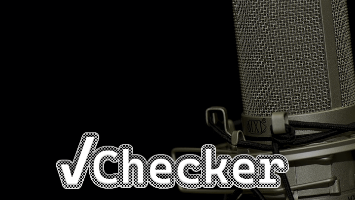

# What's Checker?

Checker is a tool for validating audio files for [LibriVox](https://librivox.org/) public domain audiobook project. It helps check technical specs, volume level, and other details before submitting recordings for inclusion in a project. [Learn more about Checker and get installation instructions.](https://cgjennings.ca/projects/checker/) 

## License information

Original code is made available under an MIT license. Some third party components are included under an Apache or LGPL license. See [`src/ca/cgjennings/apps/librivox/about.html`](src/ca/cgjennings/apps/librivox/about.html) for more information about third party components and their full license texts.
